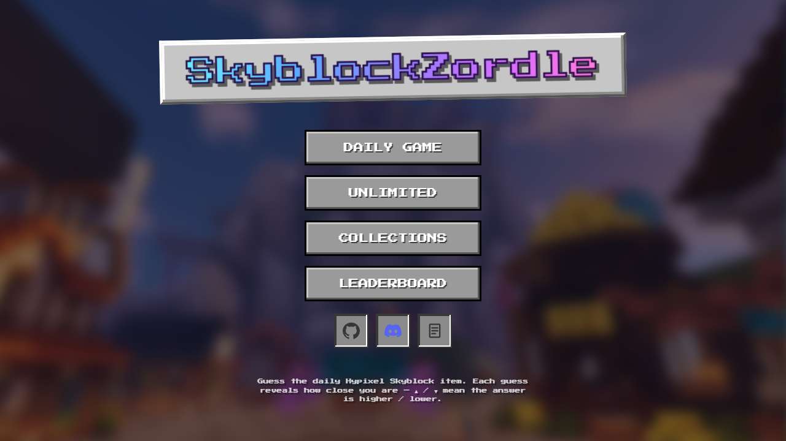
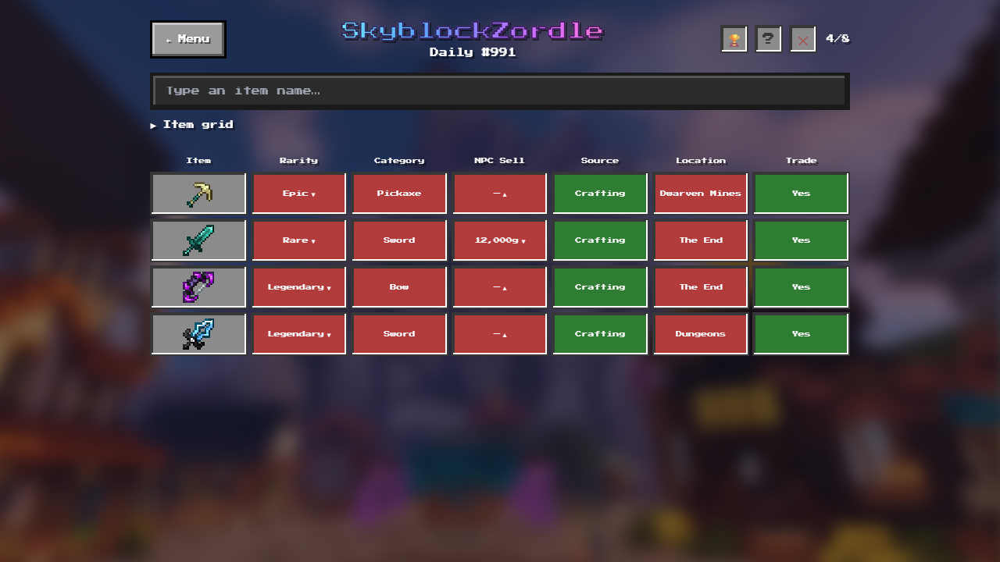
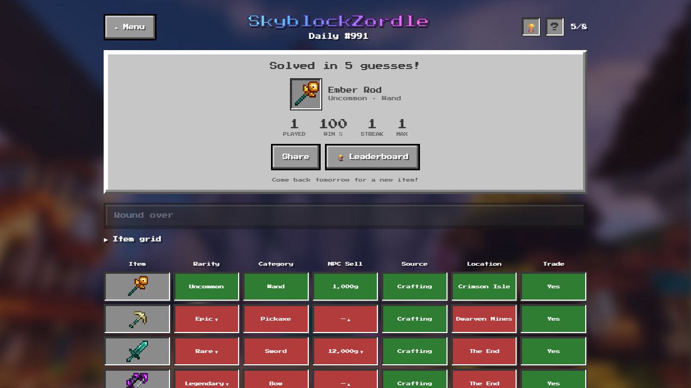
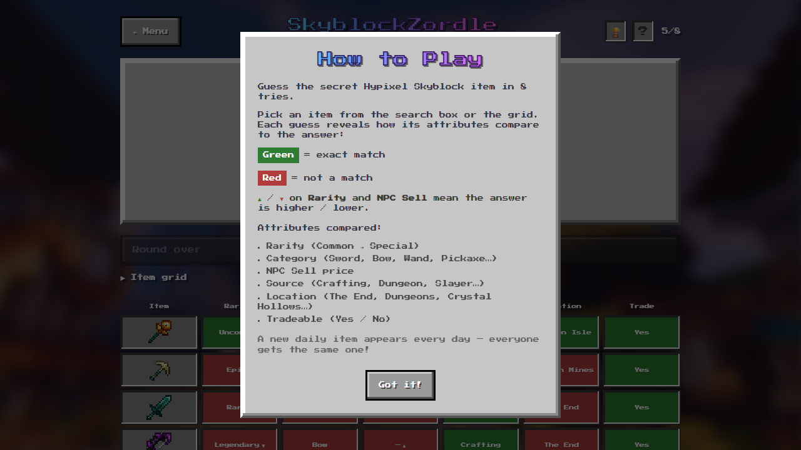
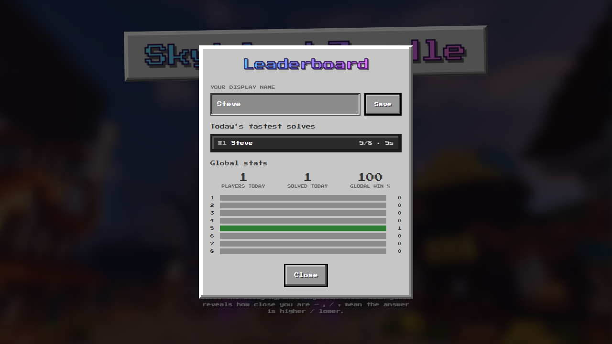
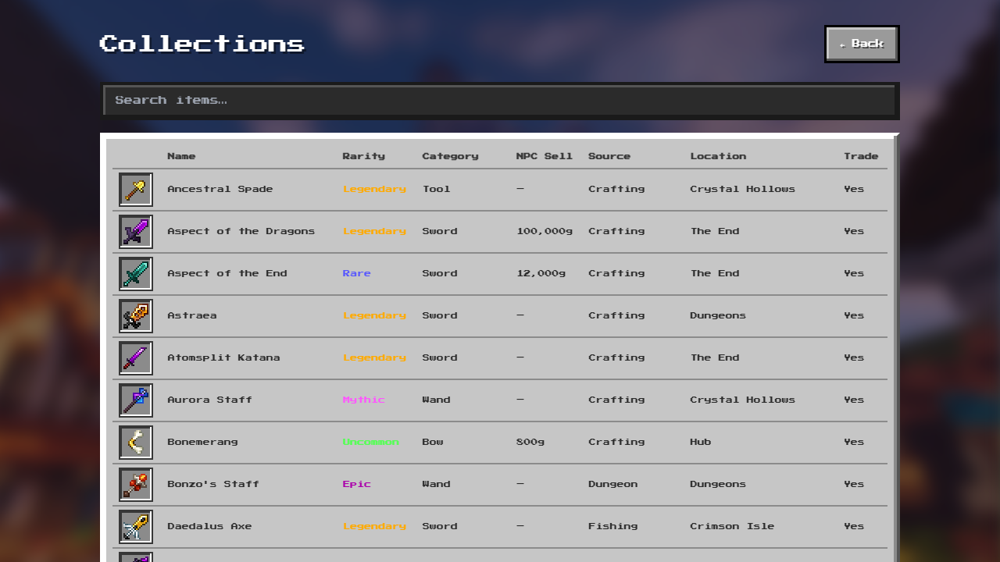

# SkyblockZordle

A daily guessing game for **Hypixel Skyblock** items — like Wordle, but instead
of five-letter words you're guessing swords, wands, bows, and tools.

## Screenshots

  
  
  
  
  
  

## How it works

Every day there's one secret Skyblock item, and you get 8 guesses to find it.
Each guess is scored against the answer attribute by attribute:

- 🟩 **Green** — that attribute matches the answer
- 🟥 **Red** — it doesn't match
- ▲ / ▼ — the answer's **Rarity** or **NPC Sell price** is higher / lower

So guessing *Hyperion* might tell you the answer is also **Legendary**, also
crafted, but sells for **less** and isn't from Dungeons — and you narrow it down
from there. The six attributes compared are **Rarity, Category, NPC Sell price,
Source, Location,** and **Tradeable**.

Everyone in the world gets the same item each day, so you can compare results
with friends.

## Features

- **Daily puzzle** — one shared item per day, with your progress saved
- **Unlimited mode** — endless random rounds, play as much as you want
- **Collections** — browse all the items and their stats
- **Stats & streaks** — games played, win rate, current and max streak
- **Share** — copy a spoiler-free emoji grid of your result
- **Global leaderboard** — the day's fastest solves

## Built with

React · Vite · Tailwind CSS · Express

The daily answer is chosen and checked on the server, so it isn't sitting in the
page for anyone to read.

---

Item art is from the official Hypixel SkyBlock Resource Pack (© Hypixel Inc.),
used under its license. A free, fan-made project — not affiliated with or
endorsed by Hypixel or Mojang.
