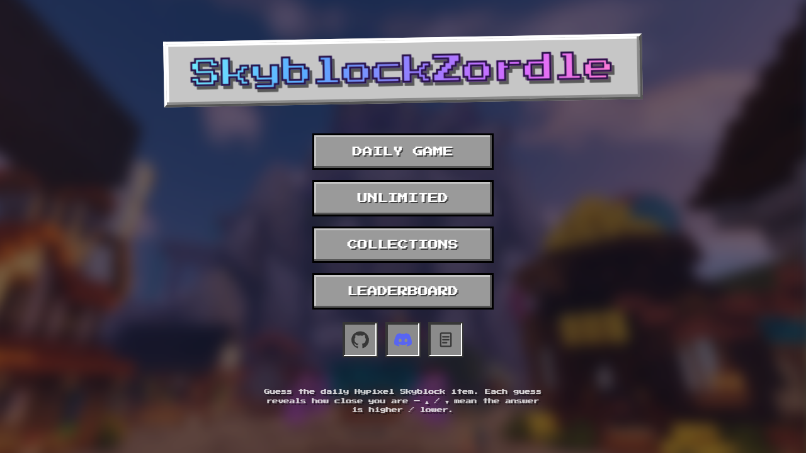
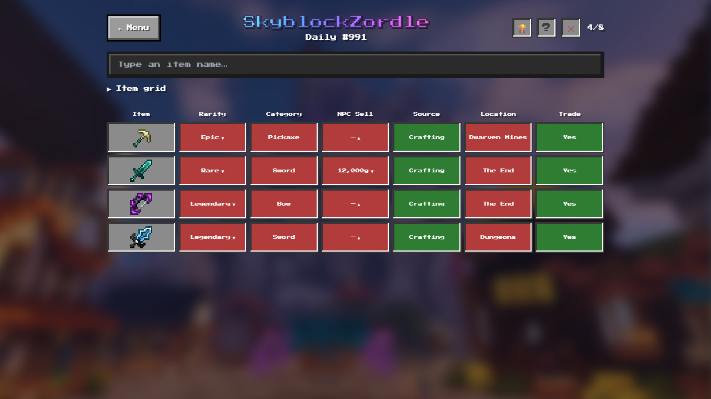
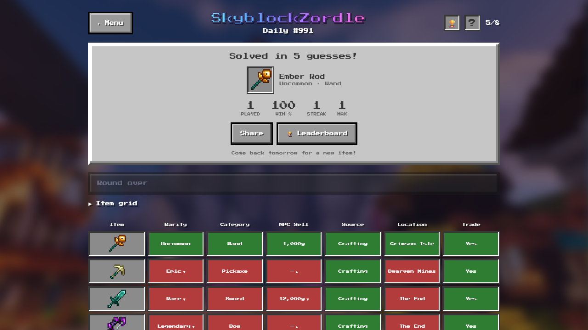
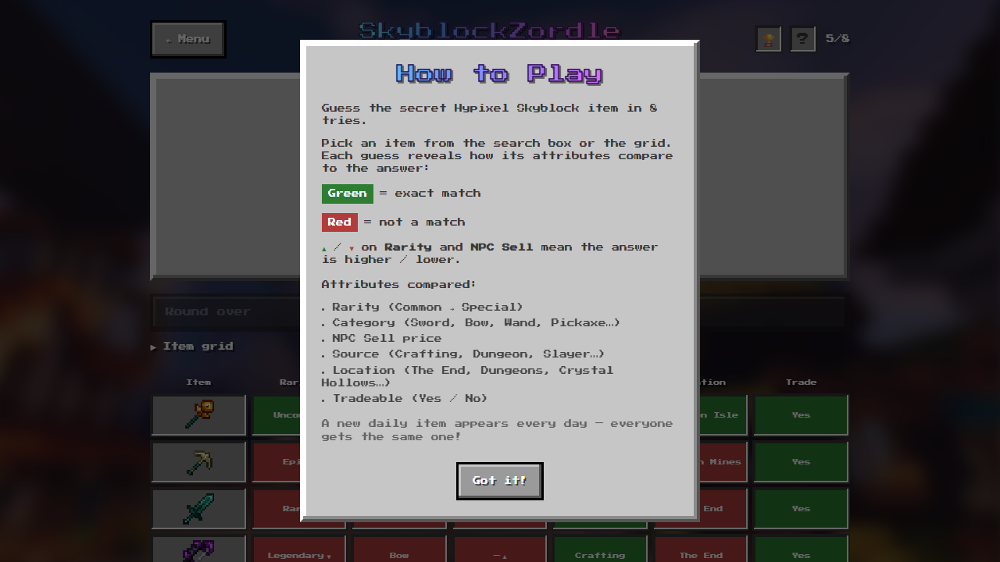
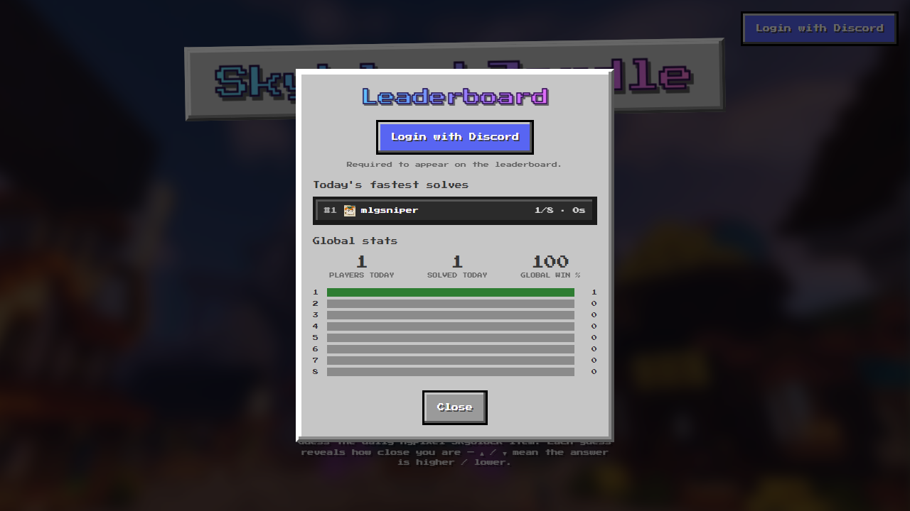
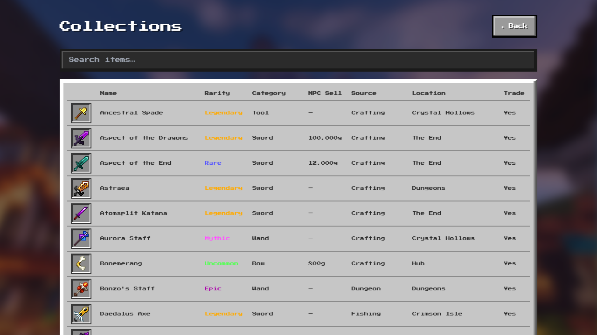

# SkyblockZordle

### ▶ Play it: **[skyblockzordle](https://d3htnxjhk2w7e2.cloudfront.net)**

A daily guessing game for **Hypixel Skyblock** items — like Wordle, but instead
of five-letter words you're guessing swords, wands, bows, and tools.

## How it works

Every day there's one secret Skyblock item, and you get 8 guesses to find it.
Each guess is scored against the answer attribute by attribute:

- 🟩 **Green** — that attribute matches the answer
- 🟥 **Red** — it doesn't match
- ▲ / ▼ — the answer's **Rarity** or **NPC Sell price** is higher / lower

So guessing *Hyperion* might tell you the answer is also **Legendary**, also
crafted, but sells for **less** and isn't from Dungeons — and you narrow it down
from there. The six attributes compared are **Rarity, Category, NPC Sell price,
Source, Location,** and **Tradeable**.

Everyone in the world gets the same item each day, so you can compare results
with friends.

## Features

- **Daily puzzle** — one shared item per day, with your progress saved
- **Unlimited mode** — endless random rounds, play as much as you want
- **Collections** — browse all the items and their stats
- **Stats & streaks** — games played, win rate, current and max streak
- **Share** — copy a spoiler-free emoji grid of your result
- **Global leaderboard** — the day's fastest solves, sign in with Discord to compete

## Screenshots

  
  
  
  
  
  

## Built with

- **Frontend** — React · Vite · Tailwind CSS
- **Backend** — AWS Lambda · DynamoDB · CloudFront + S3 · AWS SAM (infrastructure as code)

It runs entirely serverless: a Lambda Function URL for the API, DynamoDB for
scores and sessions, and the site itself served from a private S3 bucket through
CloudFront. The whole stack is defined in [`infra/template.yaml`](infra/template.yaml),
so it deploys from a single command.

### A couple of design notes

**The answer never reaches your browser.** Guesses are checked on the server, so
the daily item isn't sitting in the page for anyone to read.

**Scores can't be faked.** The server counts your guesses itself and writes the
leaderboard entry when it sees the winning guess — the browser never reports a
score. Ranking requires signing in with Discord (OAuth2 handled in Lambda,
sessions as signed tokens), so a leaderboard entry is tied to a real account.

---

Item art is from the official Hypixel SkyBlock Resource Pack (© Hypixel Inc.),
used under its license. A free, fan-made project — not affiliated with or
endorsed by Hypixel or Mojang.
